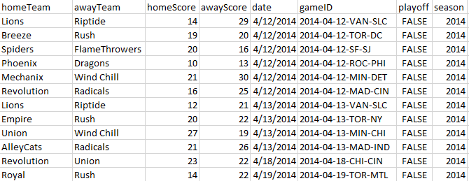

# Elo Model Creator and Optimizer

By Simon D. Weaver  

## Code
Source code can be found on [GitHub](https://github.com/weaversd/Elo_shiny_app)  

## Theory  
Article describing the theory and validation behind this app can be downloaded [here](Elo_App_Article_WeaverSD.pdf)  

## How to use:
The workflow of this app is:  
Historical Game data (.csv file) -> Default Elo Model -> Optimized Elo Model -> Prediction of Future Games  

### Data Import
Historical game data must be uploaded as a .csv file with the following columns, where each game is it's own row:  

  * `homeTeam` - a string that corresponds to a team
  * `awayTeam` - a string that corresponds to a team
  * `homeScore` - an integer that is the score of the home team
  * `awayScore` - an integer that is the score of the home team
  * `date` - a string in the format "mm/dd/yyyy". *This can be filled with a default value such as "01/01/2000" for all the games if there is no date data.
  * `playoff` - a boolean (Either "FALSE" or "TRUE") as to whether the game is a playoff. If no playoff data is available, set all games to "FALSE"
  * `season` - a character that will be linked with specific seasons. Usually a year, but can be any character. Must not be blank.
  
Other columns are ok (they will be ignored for calculations), and the order of the columns does not matter. However, capitalization is important. If there is not information for `date`, `playoff`, or `season`, you can fill these columns with defaults. Microsoft Excel is the easiest tool to use to create this .csv file. Example csv files can be found in the "Example Data" tab. A screenshot of the top rows of an example file can be seen below.

  

The "gameID" column is extra, and will be ignored. All the other columns are required.

### Game Stats  
This tab provides a summary of each team's performance as a table over the course of all the imported games, with information about wins, losses, ties, point differential and win percentage.  

There are also histograms and density plots generated that show the trends in final scores and margin of victory, both overall and taking into account home field advantage.  

Finally, the number of games won by the home and away teams are calculated, and the number of draws is also calculated.  

### Elo Parameters
This tab allows the user to try out different Elo parameters. See the article linked above for a description of each parameter. The app will take these inputs, and plot each team's Elo score over time. It will also generate the following plots:  

  * % games predicted correctly over time, including all games, and including only those past a certain time threshold
  * A Calibration plot, where games are binned into expected win % windows of 5%, and then the actual win percentages are calculated for each bin. The size of each point represents the number of games in the bin, and the red dotted line shows the error, or residual from a perfect model.
  * A residual plot, where the error from the previous plot is plotted on the y-axis.
  * A scaled residual plot, where the error from the previous plot is scaled to the number of games in the bin. The sum of the absolute values of these residuals is the scaled residual score for any given model, and is used to optimize the Elo parameters.
  * A density overlap between scaled MOV, and scaled expected win percentage, both for the home team.
  
On this tab there is also the option to download the data from the Elo model. The Elo parameters in this tab will be used for the future predictions.  

### Elo Optimization  
This tab allows the optimization of the Elo parameters in the sidebar. The starting ranges for each optimization can be set with the sliders. Clicking the 'Optimize' button will start the optimization process. See the article linked above for a detailed description of the optimization, and the output optimization plots. The optimized parameters are available to view in the optimized parameters sub-tab. Increasing the number of iterations will improve the model, but will take longer. Increasing the number of values to combine from each iteration will average more results, increasing robustness, but also being more conservative. A lower value here will be more aggressive in searching for the optimum value, but can cause 'false positive' optimum values. A lower convergence multiplier will converge faster, but explore fewer options, whereas a larger value will cast a wider net, but converge slower. Overall, the more conservative strategies will have a high number of iterations, a high number of values to combine, and a high convergence multiplier. These will take longer, but produce a better result. A dataset with 1000 games takes about 5 minutes per iteration with the default settings.  

Checking the `Use Optimized Values in Elo Tab` will automatically fill the optimized parameters into the 'Elo Parameters' tab for visualization, and use them for future predictions.  
 
### Future Predictions
The input for future predicitons is a csv file with game information. This file must be in the same format as the data Import file as described above, but without the `homeScore` and `awayScore` columns. Examples can be found in the Example data tab.
